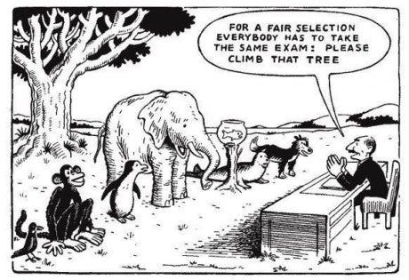

# Kendali diri dan Kembangkan Potensi Anda

---

## Pahamilah 
- Segala sesuatu yg didunia ini memiliki 2 posisi negatif dan positif.
contohnya adalah sifat rajin dan malas.

---

## Kenali negatif dan positif
Rajin 
- Positif: 
  - Mudah bergerak/memulai/Mengikuti
  - bisa melakukan kegiatan yg berulang-ulang
- Negatif: Inovasi kurang

Malas
- Positif: Banyak inovasi (Menyederhanakan, otomatisasi, dll)
- Negatif: 
  - Malas bergerak
  - tidak bisa melakukan kegiatan yg sama secara berulang-ulang (bosan/ngantuk) 

---

## Mengatasi sifat Negatif

Rajin (Menghasilkan inovasi)
- Banyak-banyak baca referensi 
- Banyak-banyak latihan

Malas (agar  tidak bosanan dan mau bergerak)
- Temukan alasan-alasan agar mau gerak
  - apa yg menarik
  - apa pentingnya
  - kenapa harus bisa
  - kenapa harus paham
  - apa kebutuhan/manfaat
  - bagaimana cara menyederhanakan biar lebih sederhana
  - bagaimana agar bisa otomatisasi
  - siapa yg tokoh yg penting yg terlihat
  - bagaimana memebelajari dari tokoh tersebut
  - bagaimana awal mulanya / sejarahnya
  - apa dampak jika saya tidak bisa
  - bagaimana agar apa yg kita kerjakan akan terus bermanfaat
  - apa tantangan setelah ini

---

Contoh kasus 
Pembuatan flight Simulator, karya pertama kali dibuat dan hasil belajar pertama lagi tetapi bisa membawa saya
- selesai tugas magang (tidak lebih dari 3 hari bikinnya)
- selesai tugas kuliah
- selesai tugas akhir
- memenangkan kejuaran 50 app terbaik di baidu store
- mendapat tawaran pendanaan dari kampus
- memenangkan tantangan di dvlup.id
- dapat support dari microsoft (selama 3 tahun semua software gratis)
- dapat support dari nokia (1/2 lusin hp terbaru gratis)
- dapat support dari unity (lisensi gratis seharga $1500)
- dapat support dari intel (membawakan acara di event intel dan mendapatkan Komputer mini/NUC dan leptop terbaru)
- pernah dapat tawaran dana pengembangan dari seseorang (pegawai bandara) dengan anggaran 100jt ketika cari data di PTDI
- pernah top paid di berbagai negara di windows phone store
- memenangkan tantangan di dicoding.com
- direkrut oleh dicoding

---
## Pesan

### Ingatlah Setiap nafas kita, akan kita pertanggungjawabkan di akhirat. Apakah melakukan hal-hal bermanfaat atau sia-sia. 

### Ingatlah beban generasi Ada juga mengalami hal yg sama. Capek, Lelah, Cemas, dll. Tinggal kita pilih berjuang dalam perubahan atau lari dari kenyataan (main game online, malas-malasan, tidak mau latihan, dll)

### carilah apa yg Allah telah anugrahkan kepadamu (Bakat/Skill/Kemampuan) 
